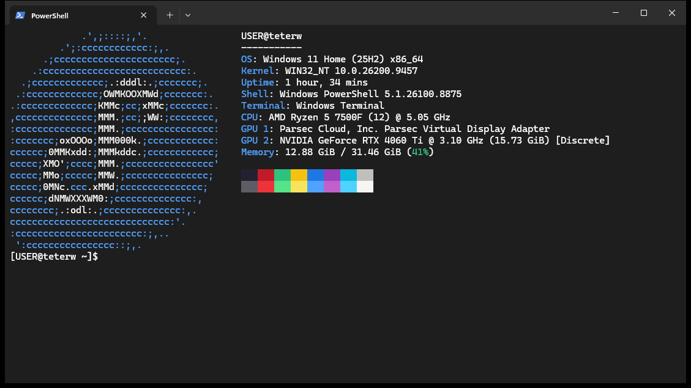
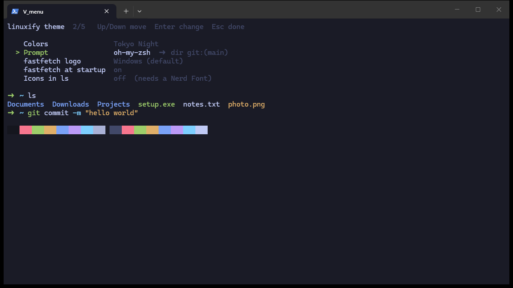
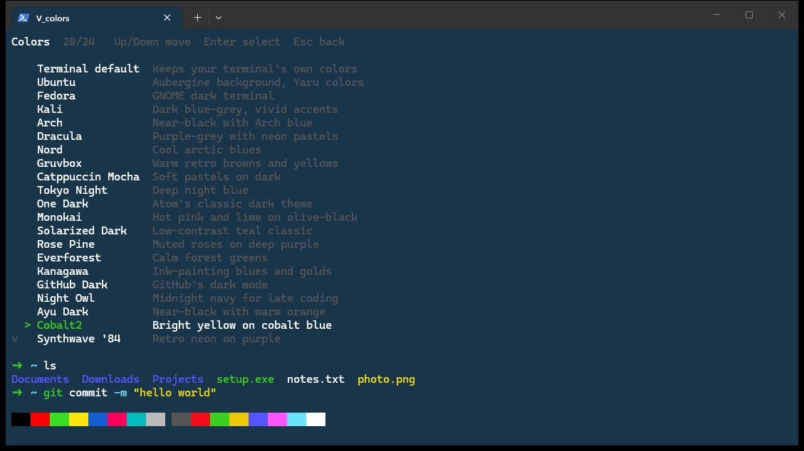
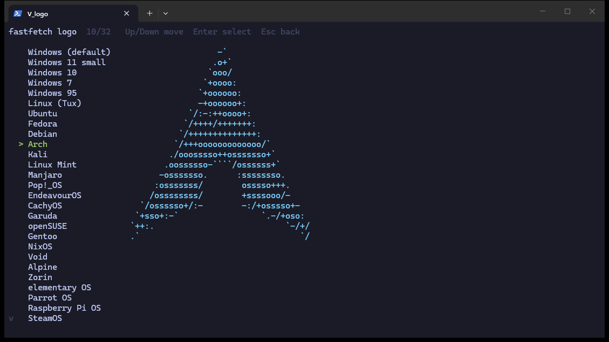
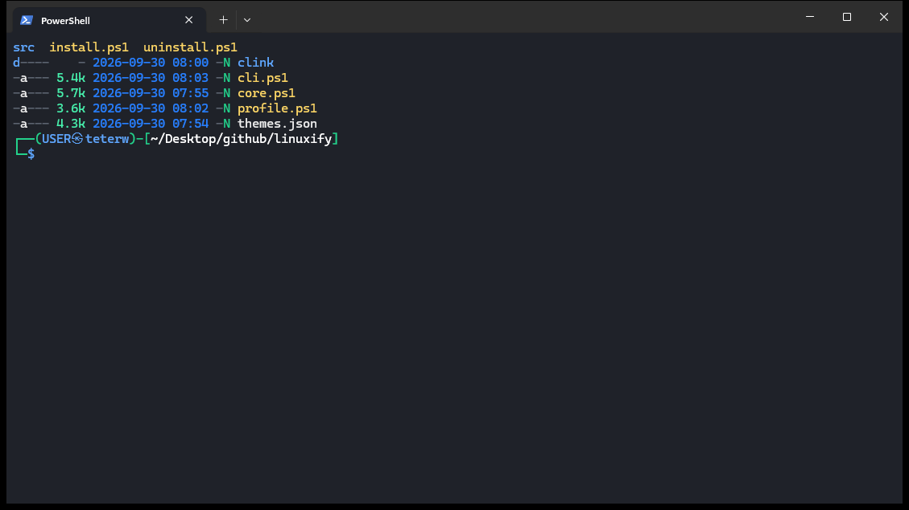
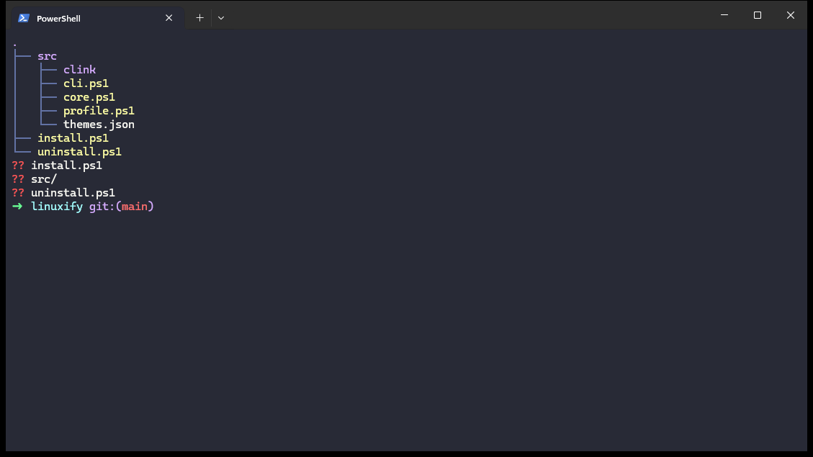
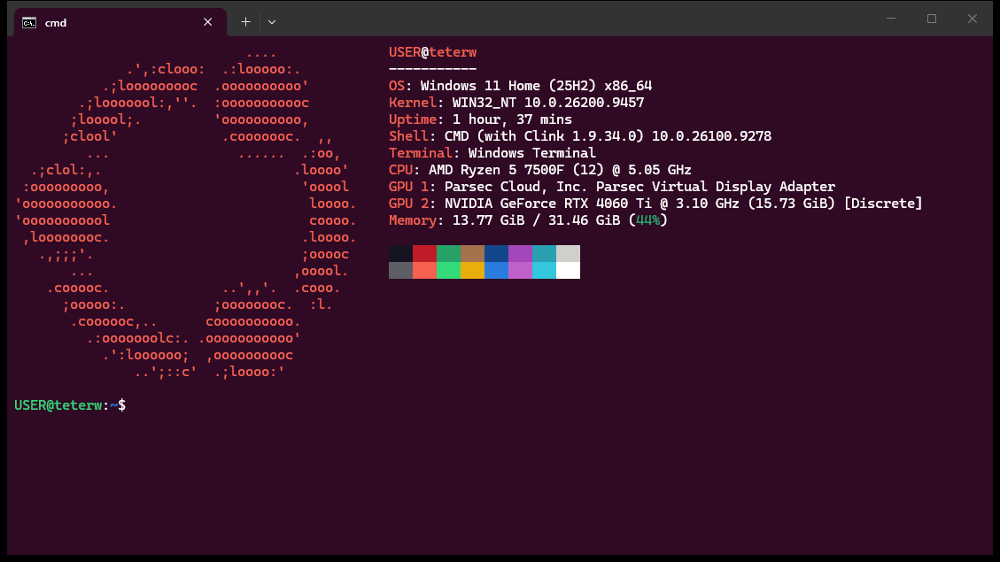

# linuxify

Make **cmd** and **PowerShell** on Windows feel like a Linux terminal, in one command.

- **Syntax colors while you type**: in cmd, commands turn green when they exist and red when they don't; in PowerShell, commands, flags, strings and variables each get their own color
- **Suggestions from your history** in grey as you type. Press **Ctrl+F** (or →) to accept, and ↑/↓ to search history for what you've typed
- **`ls` like Linux**: columns, folders in blue, programs in green, plus `ll`, `la` and `lt` (tree)
- **Linux commands** that Windows lacks: `grep`, `head`, `tail -f`, `wc`, `which`, `touch`, `df -h`, `free -h`, `uptime`, `rm -rf`, `mkdir -p`, `export`, `killall`, `open`, `sudo`...
- **Shell habits**: `cd -`, `..`, `...`, `mkcd`, `!!`, `sudo !!`
- **`theme`**: one menu to pick your **colors** (24 themes), **prompt** (10 styles) and **fastfetch logo** (32 logos), each with a live preview
- **Window options** for Windows Terminal: background **transparency**, **blur**, **font**, **font size**, **cursor shape** and a **retro CRT** effect
- **`linuxify restart`**: reload in place, like opening a new terminal
- **fastfetch** system info when a terminal opens



## Install

Paste this into PowerShell:

```powershell
irm https://raw.githubusercontent.com/teterw/linuxify/main/install.ps1 | iex
```

Then open a new terminal window. That's it.

The installer:

1. installs [Clink](https://github.com/chrisant996/clink), [eza](https://github.com/eza-community/eza) and [fastfetch](https://github.com/fastfetch-cli/fastfetch) with winget (skipped if you already have them)
2. updates PSReadLine for Windows PowerShell 5.1 if it's older than 2.3
3. copies linuxify to `%LOCALAPPDATA%\linuxify`
4. adds a 3-line block to your PowerShell profile (5.1 and 7). **Your existing profile is backed up first**, and nothing else in it is touched
5. hooks into cmd through Clink
6. sets your user's execution policy to `RemoteSigned` if it's `Restricted`, because otherwise PowerShell won't load profiles

Running it again (or `linuxify update`) updates linuxify and keeps your settings.

## Themes

Run `theme` to open the menu:



Colors, prompt and logo are separate, so you can mix them freely, for example Dracula colors with the Kali prompt and the Arch logo.

| Colors: preview changes live | Logo: previewed beside the list |
|---|---|
|  |  |

In the pickers: ↑/↓ to move, type a letter to jump, Enter to choose, Esc to go back.

**Colors (24):** Terminal default, Ubuntu, Fedora, Kali, Arch, Dracula, Nord, Gruvbox, Catppuccin Mocha, Tokyo Night, One Dark, Monokai, Solarized Dark, Rose Pine, Everforest, Kanagawa, GitHub Dark, Night Owl, Ayu Dark, Cobalt2, Synthwave '84, Hacker Green, and two light themes: Catppuccin Latte and GitHub Light.

**Prompts (10):**

| Prompt | Looks like |
|---|---|
| Linuxify (default) | `user@host:~/path (main) $` |
| Ubuntu / Debian | `user@host:~/path$` |
| Fedora / Arch | `[user@host dir]$` |
| Kali | `┌──(user㉿host)-[~]` + `└─$` |
| Parrot OS | `┌─[user@host]─[~]` + `└──╼ $` |
| oh-my-zsh | `➜  dir git:(main)` |
| fish | `user@host ~/D/github>` |
| Pure | `~/path main` + `❯` |
| Minimal | `dir ❯` |
| macOS | `user@host dir %` |

**fastfetch logos (32):** Windows (default), Windows 11 small, Windows 10, Windows 7, Windows 95, Linux (Tux), Ubuntu, Fedora, Debian, Arch, Kali, Linux Mint, Manjaro, Pop!_OS, EndeavourOS, CachyOS, Garuda, openSUSE, Gentoo, NixOS, Void, Alpine, Zorin, elementary OS, Parrot OS, Raspberry Pi OS, SteamOS, macOS, FreeBSD, Android, TempleOS, or no logo.

| Kali prompt + Kali colors | oh-my-zsh prompt + Dracula | Ubuntu in cmd |
|---|---|---|
|  |  |  |

Theme colors (background and palette) change live in **Windows Terminal**, the default terminal on Windows 11. In the old console window, you still get the prompts and syntax colors, just not the background.

### Window: transparency, blur, font, cursor

Pick **Window** in the `theme` menu (or run `theme window`) for Windows Terminal's look. Changes show up right away in every tab, and the pickers preview them live as you move.

| Option | Command | |
|---|---|---|
| Transparency | `theme transparency 20` | see-through background, 0–90% |
| Blur | `theme blur on` | frosted glass behind a transparent background |
| Font | `theme font` / `theme font "JetBrainsMono NF"` | lists your installed fixed-width fonts; `theme font default` resets |
| Font size | `theme fontsize 13` | |
| Cursor | `theme cursor block` | `bar` `block` `underscore` `box` `double` `vintage` |
| Retro effect | `theme retro on` | old CRT monitor: scanlines and glow (try it with Hacker Green) |

These are saved in Windows Terminal's own `settings.json`, under `profiles` → `defaults`, so they apply to cmd and PowerShell tabs alike. linuxify edits just those lines and leaves the rest of the file (and its formatting) alone. The first change makes a copy of the file next to it (`settings.json.linuxify-backup`), and `linuxify uninstall` puts your old values back. If one of your Windows Terminal profiles sets its own font or transparency, it keeps it, and linuxify tells you which.

### linuxify restart

`linuxify restart` (or `linuxify reload`) clears the screen and runs linuxify's startup again: your colors, your fastfetch logo, and any updated linuxify code. It's like opening a new terminal, without losing your tab.

## Linux commands

These work in both cmd and PowerShell, including in pipes (`git log | grep fix | head -5`):

| Command | What it does |
|---|---|
| `grep [-ivnclLrwFoqs] PATTERN [FILE...]` | search text, matches highlighted; `-r` searches folders |
| `head [-n N]` / `tail [-n N] [-f]` | first / last lines; `tail -f` follows a growing log |
| `wc [-lwc]` | count lines, words, bytes |
| `which NAME` | where a command lives |
| `touch FILE` | create a file or update its timestamp |
| `df -h` / `free -h` / `uptime [-p]` | disk space, memory, time since boot |
| `rm -rf`, `mkdir -p` | Linux flags; `rm` refuses drive roots, your home and Windows folders |
| `export A=1`, `unset A`, `env` | environment variables |
| `killall NAME` | close a program by name (`-9` to force) |
| `open` / `xdg-open` | open a file, folder or URL with its default app |
| `sudo COMMAND` | run as administrator (see below) |
| `pwd` | print the current folder |

If you already have real GNU tools on your PATH (from Git or MSYS2, for example), those are used instead.

In PowerShell, `rm`, `mkdir` and `pwd` only act like Linux when you type them. Scripts still get the normal PowerShell commands, and so does anything using PowerShell-style parameters like `rm -Recurse`.

**sudo** uses the `sudo` built into Windows 11. By default Windows runs it in a new window. For Linux-style sudo, where the output appears right in your terminal, run `linuxify sudo inline` once (Windows will ask for permission). On older Windows, `sudo` opens an elevated window instead.

## Shell habits

| Type | To |
|---|---|
| `cd -` | go back to the previous folder |
| `cd` | go to your home folder |
| `..` `...` `....` | go up 1, 2 or 3 folders |
| `mkcd DIR` | make a folder (and any parents) and go into it |
| `!!` | repeat the last command, for example `sudo !!` |
| `!$` | the last argument of the last command |
| Ctrl+F or → | accept the grey suggestion |

## Commands

| Command | What it does |
|---|---|
| `theme` | menu: colors, prompt, fastfetch logo, window, fastfetch at startup, icons |
| `theme colors` / `theme colors nord` | pick colors, or set them directly |
| `theme prompt` / `theme prompt kali` | pick a prompt style, or set it directly |
| `theme logo` / `theme logo arch` | pick the fastfetch logo, or set it directly |
| `theme window` | Windows Terminal: transparency, blur, font, font size, cursor, retro effect |
| `theme transparency 20` `theme blur on` `theme font` `theme fontsize 13` `theme cursor block` `theme retro on` | change one window option directly ([details](#window-transparency-blur-font-cursor)) |
| `theme list` | list every color theme, prompt and logo, and your window options |
| `linuxify restart` | reload linuxify in this tab, like opening a new terminal |
| `ls` `ll` `la` `lt` | list / long list / include hidden / tree |
| `fastfetch` | system info with your chosen logo |
| `linuxify fetch on\|off` | show fastfetch when a terminal opens |
| `linuxify icons on\|off` | file icons in `ls` (needs a [Nerd Font](https://www.nerdfonts.com/)) |
| `linuxify sudo [inline\|window\|off]` | how Windows' sudo runs commands |
| `linuxify update` | update to the latest version |
| `linuxify uninstall` | remove linuxify |

All of these work in both cmd and PowerShell.

## Uninstall

```powershell
linuxify uninstall
```

or, if the `linuxify` command is gone:

```powershell
irm https://raw.githubusercontent.com/teterw/linuxify/main/uninstall.ps1 | iex
```

This removes the profile block, unhooks Clink, and puts back the Clink and Windows Terminal settings it changed. Clink, eza and fastfetch stay installed, and the uninstaller prints the `winget uninstall` commands if you want them gone too.

## Good to know

- In PowerShell, `ls` now prints text like Linux instead of returning objects. For scripts and pipelines such as `Get-ChildItem | Where-Object ...`, use `gci` or `dir`, which are unchanged.
- In cmd, linuxify's commands work when typed (including in pipes), but not inside `.bat` files. The ones that run through PowerShell (`grep`, `head`, `tail`, `wc`, `touch`, `df`, `free`, `uptime`, `rm`, `killall`) take a moment to start.
- PowerShell can't color unknown commands red while you type (PSReadLine doesn't support it), but it does turn the end of the prompt red on syntax errors. cmd does the red/green check through Clink.
- fastfetch doesn't run in VS Code's terminal, in scripts, or in a shell started from another shell.
- Windows Terminal resets theme colors whenever its settings change (from linuxify's window options or its own Settings page). linuxify puts them back at the next prompt in each tab.
- Upgrading from 1.0 keeps your colors and prompt. The logo resets to Windows, since logos are now their own setting.

## Credits

linuxify is a small layer that sets up and themes these tools:
[Clink](https://github.com/chrisant996/clink) ·
[PSReadLine](https://github.com/PowerShell/PSReadLine) ·
[eza](https://github.com/eza-community/eza) ·
[fastfetch](https://github.com/fastfetch-cli/fastfetch).
Color themes are based on the Ubuntu/GNOME, Dracula, Nord, Gruvbox, Catppuccin, Tokyo Night, One Dark, Monokai, Solarized, Rosé Pine, Everforest, Kanagawa, GitHub, Night Owl, Ayu, Cobalt2 and Synthwave '84 palettes.

## License

MIT
